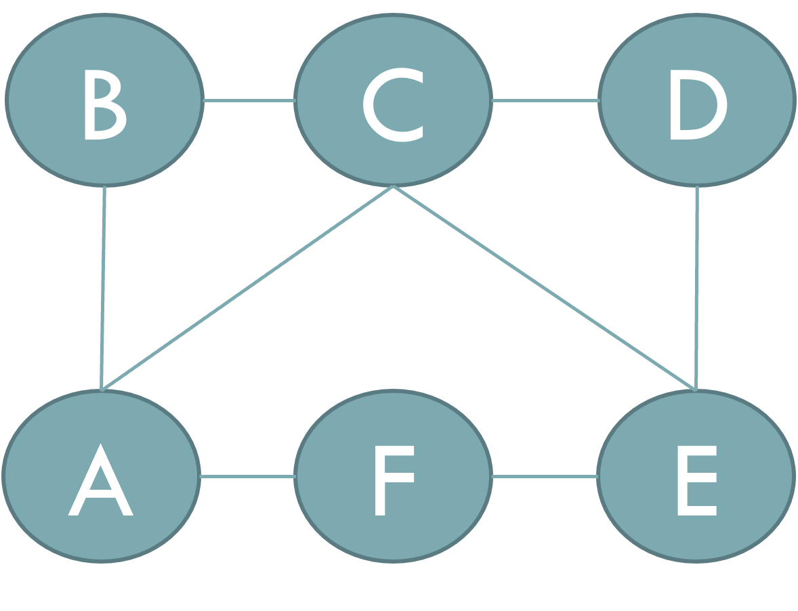
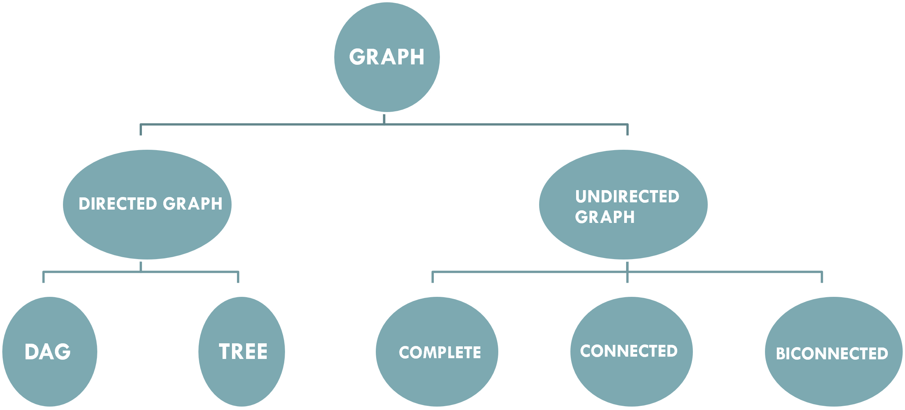
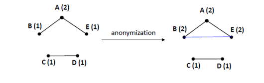
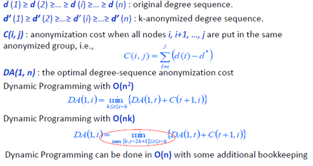
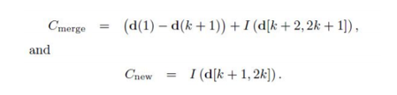

# Identity Anonymization on Graphs Using Dynamic Programming

Anonymization is the process of either Encrypting or removing personally identifiable information from Datasets so that the people whom the data describes remain anonymous.

## GRAPH THEORY

► A graph is a data structure that is defined by two components.

► A node or vertex.

► An edge E or ordered pair is a connection between two nodes (u,v) that is identified by unique pair(u,v).

### CHARACTERISTICS OF GRAPH

►Path

►Adjacent

►Degree node

►Isolated node

### TYPE OF GRAPH

### GRAPH ANONYMIZATION**

Removing the identities of the nodes before publishing the graph/social network data does not guarantee privacy, the structure of the graph itself, should change to provide privacy for the client

A graph g(v, e) is k-degree anonymous if every node in v has the same degree as k-1 other nodes in v.

### GRAPH ANONYMIZATION PROBLEM

Given a graph G(V, E)and an integer k, modify G via a minimal set of edge addition or deletion operations to construct a new graph G’(V’, E’)such that :

► G’ is k-degree anonymous; 

► V’ = V;

► The symmetric difference of G and G’ is as small as possible

### GRAPH ANONYMIZATION ALGORITHM

*INPUT* : Graph ***G*** with degree sequence ***d***, integer ***k***

*OUTPUT **: k***-degree anonymous graph **G’**

► **Degree Sequence Anonymization**

Contract an ***k***-anonymized degree sequence **d’** from the original degree sequence ***d*** such that **||d’-d||is minimized**

► **Graph Construction**

### DEGREE SEQUENCE ANONYMIZATION

► Dynamic Programming.

### DEGREE SEQUENCE ANONYMIZATION

► Greedy algorithm.

The Greedy algorithm first forms a group consisting of the first k highest-degree nodes nd assigns to all of them degree d(1), Then it checks whether it should merge the (k+1)-the node into the previously formed group or start a new group at position

### IMPLEMENTATION

I have implemented Dynamic programming, Dynamic programming optimization and Greedy to anonymize the dataset, Not all selected k values achieves a graph dataset so we test the result using the graph theory concepts to check if it is a graph or not.

#### First Test on **“Football” graph dataset”**

Number of nodes: 115, Number of edges: 613

The algorithm works perfectly with the following K values [11, 12, 13, 14, 15, 16, 17].

And get the Performance ratio (R):
[10.0, 10.0, 2.8, 4.8, 4.0, 4.4, 5.2, 1.3571428571428572, 1.4285714285714286, 0\.7142857142857143, 1.0, 1.2857142857142858, 1.7142857142857142, 1\.7142857142857142, 2.2857142857142856, 1.3571428571428572, 1.3571428571428572, 2\.0714285714285716]  R=18

#### Second Test on **“the Society of Friends” graph dataset”**

Number of nodes: 119, Number of edges: 174

The algorithm works perfectly with the following K values [3, 4, 5, 7, 11, 13, 15, 16, 18].

And get the Performance ratio (R):

[1.125, 3.125, 3.125, 4.0625, 4.625, 7.1875, 6.9375, 7.6875, 9.125, 9.9375, 10.875, 12\.0625, 15.625, 16.0, 15.4375, 16.375, 18.0625, 18.3125] R=18
